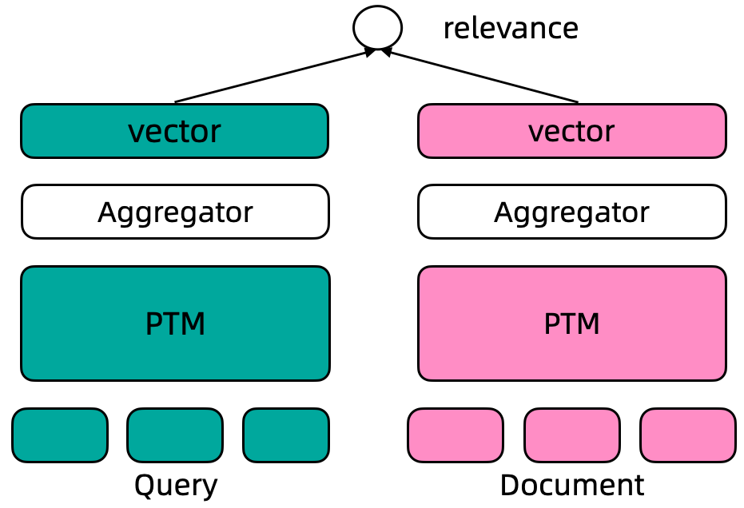

---
tasks:
- sentence-embedding
widgets:
  - task: sentence-embedding
    inputs:
      - type: text
        name: source_sentence
      - type: text-list
        name: sentences_to_compare
    examples:
      - name: 示例1
        inputs:
          - data:
            - 功和功率的区别
          - data: 
            - 功反映做功多少，功率反映做功快慢。
            - 什么是有功功率和无功功率?无功功率有什么用什么是有功功率和无功功率?无功功率有什么用电力系统中的电源是由发电机产生的三相正弦交流电,在交>流电路中,由电源供给负载的电功率有两种;一种是有功功率,一种是无功功率.
            - 优质解答在物理学中,用电功率表示消耗电能的快慢．电功率用P表示,它的单位是瓦特（Watt）,简称瓦（Wa）符号是W.电流在单位时间内做的功叫做电功率 以灯泡为例,电功率越大,灯泡越亮.灯泡的亮暗由电功率（实际功率）决定,不由通过的电流、电压、电能决定!
      - name: 示例2
        inputs:
          - data:
            - 什么是桥
          - data:
            - 由全国科学技术名词审定委员会审定的科技名词“桥”的定义为：跨越河流、山谷、障碍物或其他交通线而修建的架空通道
            - 桥是一种连接两岸的建筑
            - 转向桥，是指承担转向任务的车桥。一般汽车的前桥是转向桥。四轮转向汽车的前后桥，都是转向桥。
            - 桥梁艺术研究桥梁美学效果的艺术。起源于人类修建桥梁的实践。作为一种建筑，由于功能不同、使用材料有差别，桥梁表现为不同的结构和形式。基本的有拱桥、梁桥和吊桥。
      - name: 示例3
        inputs:
          - data:
            - 福鼎在哪个市
          - data:
            - 福鼎是福建省宁德市福鼎市。
            - 福鼎位于福建省东北部，东南濒东海，水系发达，岛屿星罗棋布。除此之外，福鼎地貌丰富，著名的太姥山就在福鼎辖内，以峰险、石奇、洞幽、雾幻四绝著称于世。
            - 福鼎市人民政府真诚的欢迎国内外朋友前往迷人的太姥山观光、旅游。
            - 福建省福鼎市桐山街道,地处福鼎城区,地理环境优越,三面环山,东临大海,境内水陆交通方便,是福鼎政治、经济、文化、交通中心区。
      - name: 示例4
        inputs:
          - data:
            - 吃完海鲜可以喝牛奶吗?
          - data: 
            - 不可以，早晨喝牛奶不科学
            - 吃了海鲜后是不能再喝牛奶的，因为牛奶中含得有维生素C，如果海鲜喝牛奶一起服用会对人体造成一定的伤害
            - 吃海鲜是不能同时喝牛奶吃水果，这个至少间隔6小时以上才可以。
            - 吃海鲜是不可以吃柠檬的因为其中的维生素C会和海鲜中的矿物质形成砷
model-type:
- bert

domain:
- nlp

frameworks:
- pytorch

backbone:
- transformer

metrics:
- mrr@10
- recall@1000

license: Apache License 2.0

language:
- en

tags:
- text representation
- text retrieval
- passage retrieval
- Transformer
- ROM
- 文本相关性
- 文本相似度

datasets:
  train:
   - dureader retrieval passage train dataset
  test:
   - dureader retrieval passage dev dataset
---

# coROM中文通用文本表示模型

文本表示是自然语言处理(NLP)领域的核心问题, 其在很多NLP、信息检索的下游任务中发挥着非常重要的作用。近几年, 随着深度学习的发展，尤其是预训练语言模型的出现极大的推动了文本表示技术的效果, 基于预训练语言模型的文本表示模型在学术研究数据、工业实际应用中都明显优于传统的基于统计模型或者浅层神经网络的文本表示模型。这里, 我们主要关注基于预训练语言模型的文本表示。

文本表示示例, 输入一个句子, 输入一个固定维度的连续向量:

- 输入: 吃完海鲜可以喝牛奶吗?
- 输出: [0.27162,-0.66159,0.33031,0.24121,0.46122,...]

文本的向量表示通常可以用于文本聚类、文本相似度计算、文本向量召回等下游任务中。

## Dual Encoder文本表示模型

基于监督数据训练的文本表示模型通常采用Dual Encoder框架, 如下图所示。在Dual Encoder框架中, Query和Document文本通过预训练语言模型编码后, 通常采用预训练语言模型[CLS]位置的向量作为最终的文本向量表示。基于标注数据的标签, 通过计算query-document之间的cosine距离度量两者之间的相关性。

<div align=center></div>

## 使用方式和范围

使用方式:
- 直接推理, 对给定文本计算其对应的文本向量表示，向量维度768

使用范围:
- 本模型可以使用在通用领域的文本向量表示及其下游应用场景, 包括双句文本相似度计算、query&多doc候选的相似度排序

### 如何使用

在ModelScope框架上，提供输入文本(默认最长文本长度为128)，即可以通过简单的Pipeline调用来使用coROM文本向量表示模型。ModelScope封装了统一的接口对外提供单句向量表示、双句文本相似度、多候选相似度计算功能

#### 代码示例
```python
from modelscope.models import Model
from modelscope.pipelines import pipeline
from modelscope.utils.constant import Tasks

model_id = "damo/nlp_corom_sentence-embedding_chinese-base"
pipeline_se = pipeline(Tasks.sentence_embedding,
                       model=model_id, model_revision='master')

# 当输入包含“soure_sentence”与“sentences_to_compare”时，会输出source_sentence中首个句子与sentences_to_compare中每个句子的向量表示，以及source_sentence中首个句子与sentences_to_compare中每个句子的相似度。
inputs = {
        "source_sentence": ["吃完海鲜可以喝牛奶吗?"],
        "sentences_to_compare": [
            "不可以，早晨喝牛奶不科学",
            "吃了海鲜后是不能再喝牛奶的，因为牛奶中含得有维生素C，如果海鲜喝牛奶一起服用会对人体造成一定的伤害",
            "吃海鲜是不能同时喝牛奶吃水果，这个至少间隔6小时以上才可以。",
            "吃海鲜是不可以吃柠檬的因为其中的维生素C会和海鲜中的矿物质形成砷"
        ]
    }

result = pipeline_se(input=inputs)
print (result)

# {'text_embedding': array([[-0.2321947 ,  0.41309452,  0.26903808, ..., -0.27691665,
#         0.39870635,  0.26265666],
#       [-0.2236533 ,  0.4202284 ,  0.2666558 , ..., -0.26484373,
#         0.40744486,  0.27727932],
#       [-0.25315344,  0.38203233,  0.24046004, ..., -0.32800043,
#         0.41472995,  0.29768184],
#       [-0.24323441,  0.41074473,  0.24910843, ..., -0.30696338,
#         0.40286067,  0.2736369 ],
#       [-0.25041905,  0.37499064,  0.24194787, ..., -0.31972343,
#         0.41340488,  0.27778068]], dtype=float32), 'scores': [70.26203918457031, 70.42508697509766, 70.55732727050781, 70.36207580566406]}

# 当输入仅含有soure_sentence时，会输出source_sentence中每个句子的向量表示以及首个句子与其他句子的相似度。
inputs2 = {
        "source_sentence": [
            "不可以，早晨喝牛奶不科学",
            "吃了海鲜后是不能再喝牛奶的，因为牛奶中含得有维生素C，如果海鲜喝牛奶一起服用会对人体造成一定的伤害",
            "吃海鲜是不能同时喝牛奶吃水果，这个至少间隔6小时以上才可以。",
            "吃海鲜是不可以吃柠檬的因为其中的维生素C会和海鲜中的矿物质形成砷"
        ]
}
result = pipeline_se(input=inputs2)
print (result)
# {'text_embedding': array([[-0.22365333,  0.4202284 ,  0.2666558 , ..., -0.26484376,
#         0.40744498,  0.2772795 ],
#       [-0.25315338,  0.38203242,  0.24046004, ..., -0.3280005 ,
#         0.41472986,  0.29768166],
#       [-0.24323441,  0.41074485,  0.24910843, ..., -0.30696347,
#         0.40286088,  0.27363694],
#       [-0.25041893,  0.3749906 ,  0.24194777, ..., -0.3197233 ,
#         0.41340476,  0.27778062]], dtype=float32), 'scores': [70.5133285522461, 70.56582641601562, 70.45124816894531]}
```

**默认向量维度768, scores中的score计算两个向量之间的L2距离得到**

### 模型局限性以及可能的偏差

本模型基于Dureader Retrieval中文数据集(通用领域)上训练，在垂类领域英文文本上的文本效果会有降低，请用户自行评测后决定如何使用

### 训练流程

- 模型: 双塔文本表示模型, 采用coROM模型作为预训练语言模型底座
- 二阶段训练: 模型训练分为两阶段, 一阶段的负样本数据从官方提供的BM25召回数据中采样, 二阶段通过Dense Retrieval挖掘难负样本扩充训练训练数据重新训练

模型采用4张NVIDIA V100机器训练, 超参设置如下:
```
train_epochs=3
max_sequence_length=128
batch_size=64
learning_rate=5e-6
optimizer=AdamW
```

### 模型效果评估

我们主要在文本向量召回场景下评估模型效果, DuReader Retrieval 召回评估结果如下:

| Model       | MRR@10 | Recall@1 | Recall@50 | 
|-------------|--------|----------| ----------|
| BM25        | 21.97  | 12.85    | 66.35     |
| DPR         | 60.45  | 45.75    | 91.75     |
| CoROM-Base       | 65.82  | 54.68    | 93.00     |
| CoROM-Tiny       | 34.90  | 24.65    | 77.63     |

## 引用

```BibTeX
@article{Qiu2022DuReader\_retrievalAL,
  title={DuReader\_retrieval: A Large-scale Chinese Benchmark for Passage Retrieval from Web Search Engine},
  author={Yifu Qiu and Hongyu Li and Yingqi Qu and Ying Chen and Qiaoqiao She and Jing Liu and Hua Wu and Haifeng Wang},
  journal={ArXiv},
  year={2022},
  volume={abs/2203.10232}
}
```